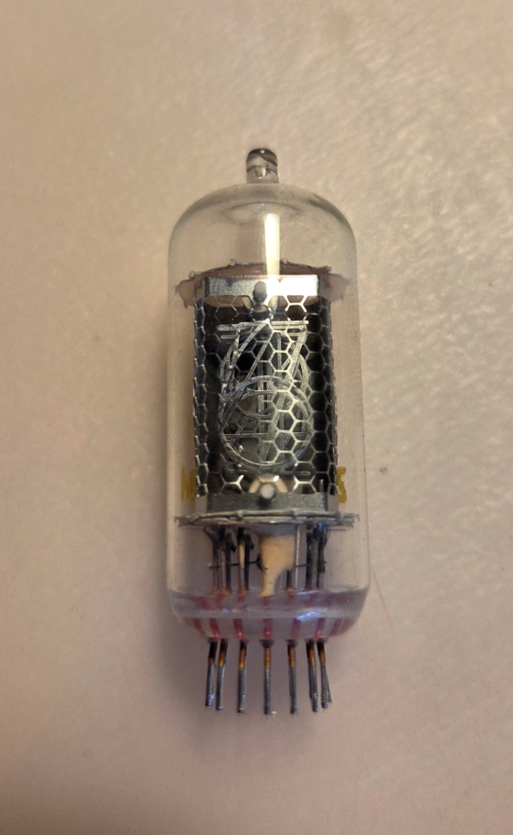
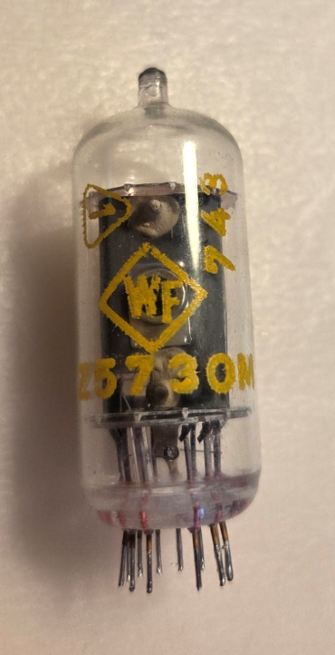
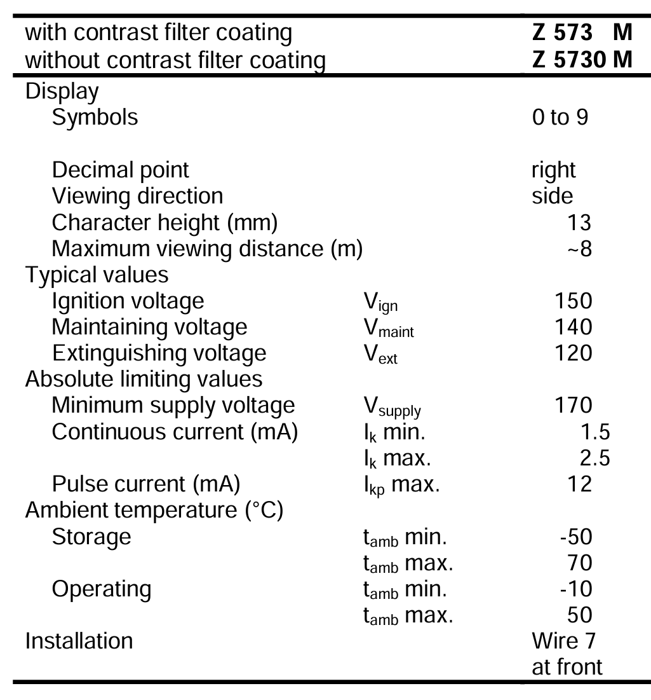
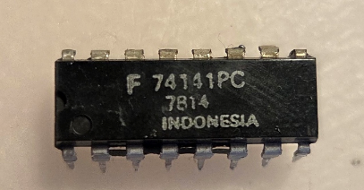
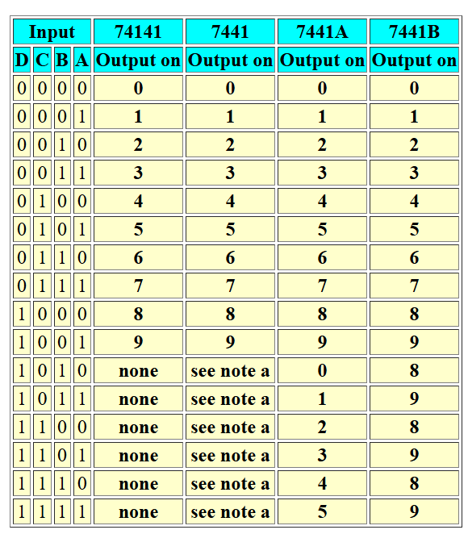
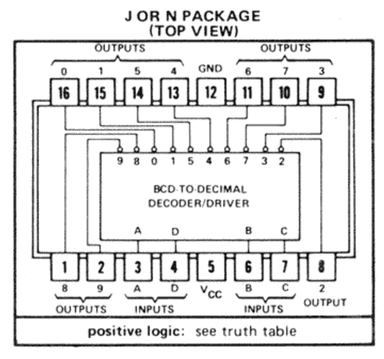

# Z5730M-Nixie-clock

## list of contents
1. [Links](#links)
2. [Nixie lamps](#nixie-lamps)
3. [Driver](#driver)
4. [MCU](#mcu)
5. [Power supply](#power-supply)

---

## Links
* [Z5730M (RFT) Nixie Röhre / Nixie Tube](https://www.tube-tester.com/sites/nixie/data/z5730m/z5730m.htm)
* [74141 BCD decoder](https://kevinrye.net/index_files/driving_a_nixie_with_a_74141_bcd_decoder.php)'
* [74141 datasheets](https://www.tube-tester.com/sites/nixie/74141-NDT/74141-NDT.htm)
## Nixie lamps Z5730M

### Pinout

### Datasheet 

## Driver

### truth table

### Pinout

## MCU

## Power supply
