# Z5730M-Nixie-clock

## list of contents
1. [Links](#links)
2. [Nixie lamps](#nixie-lamps)
3. [Driver](#driver)
4. [MCU](#mcu)
5. [Power supply](#power-supply)
5. [BOM links](#bom-links)

---

## Links
* [Z5730M (RFT) Nixie Röhre / Nixie Tube](https://www.tube-tester.com/sites/nixie/data/z5730m/z5730m.htm)
* [74141 BCD decoder](https://kevinrye.net/index_files/driving_a_nixie_with_a_74141_bcd_decoder.php)'
* [74141 datasheets](https://www.tube-tester.com/sites/nixie/74141-NDT/74141-NDT.htm)
* [Hackaday.io power v1](https://hackaday.io/project/162301/logs)
* [Hackaday.io power v2](https://hackaday.io/project/170962-nixie-tube-170-v-flyback-dc-dc-power-converter#j-discussions-title)
## Nixie lamps Z5730M
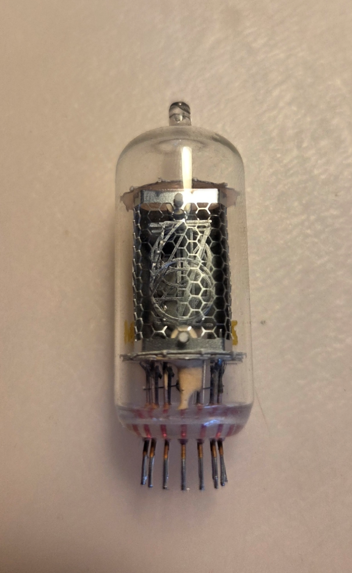
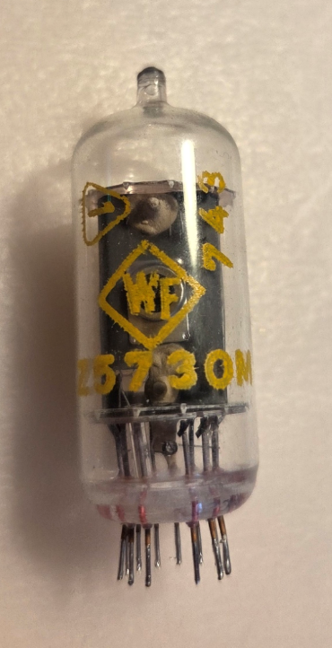
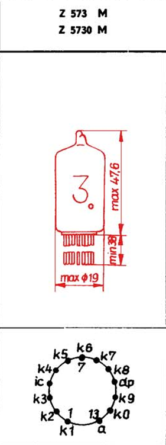
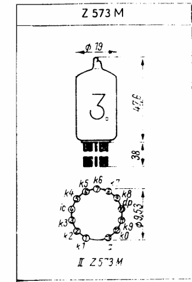

### Pinout
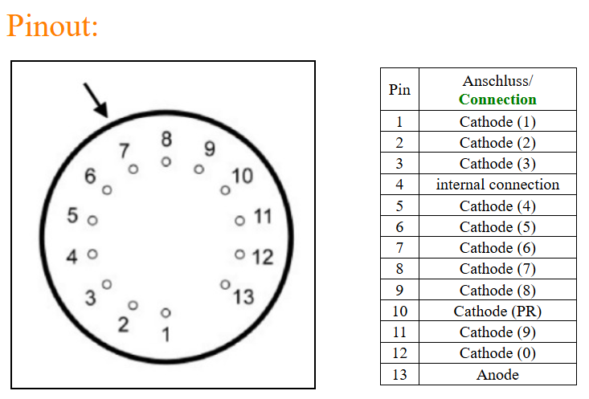
### Datasheet 
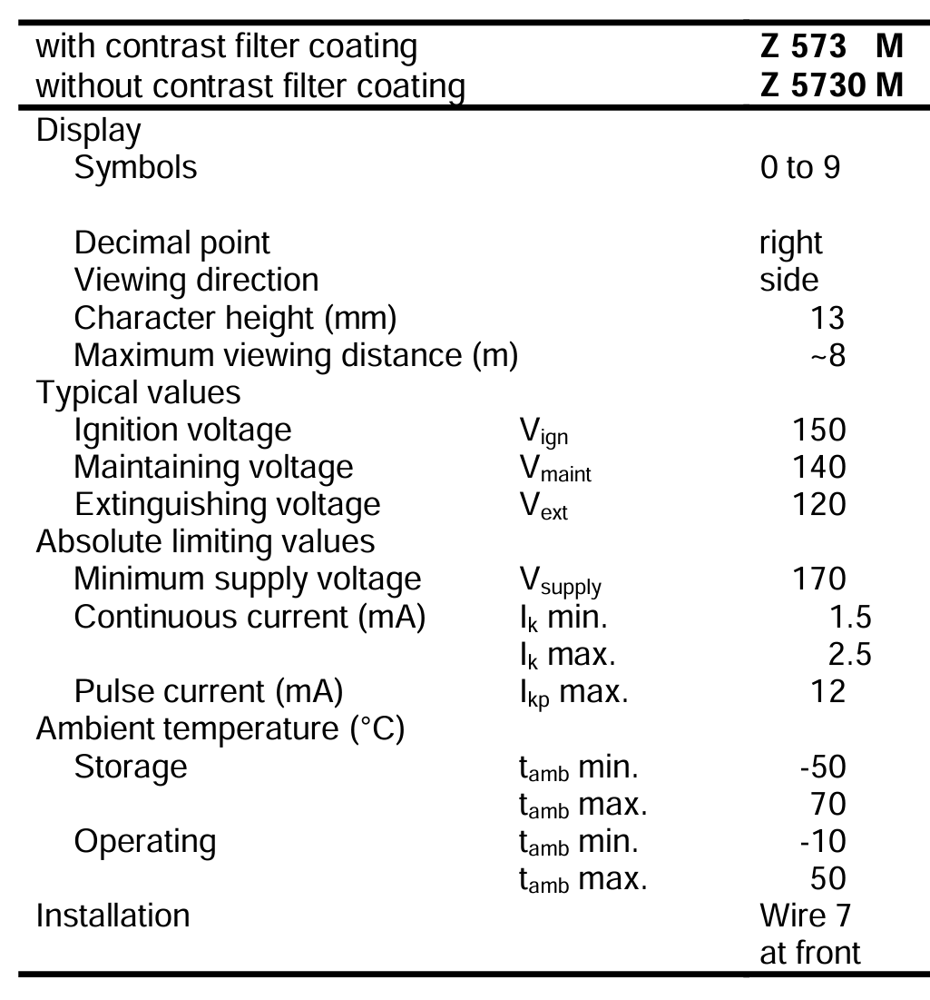
## Driver
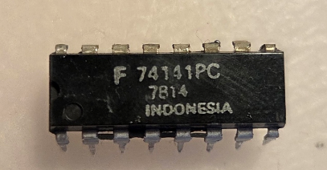

### truth table
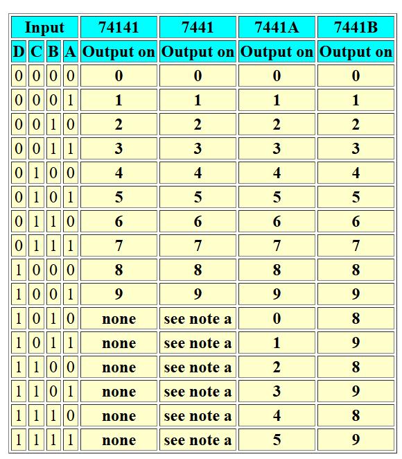
### Pinout
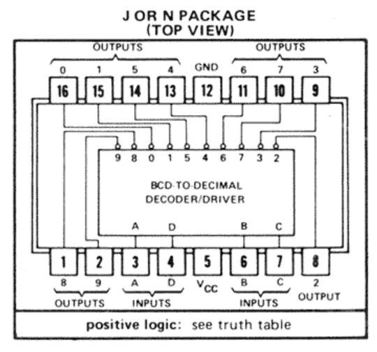
## MCU
ESP32-S3-WROOM-1-N16R2

ESP Hardware Design Guidelines - https://docs.espressif.com/projects/esp-hardware-design-guidelines/en/latest/esp32s3/index.html
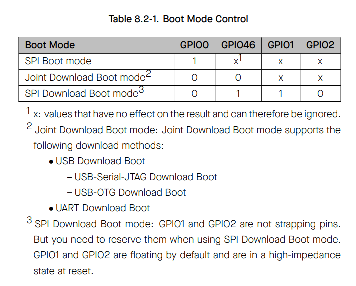
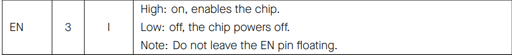

## Power supply
Woking voltage for Z5730M is 140V, power supply will be 170V, cathode current for this type is 2mA.
R = Vcc-Vworking / I = (170-140) / 0.002 = 15kOhm

## BOM links

dip16 socket - https://www.digikey.pl/pl/products/detail/te-connectivity-amp-connectors/1-2199298-4/5022041?gclsrc=aw.ds&gad_source=1&gad_campaignid=20228863357&gbraid=0AAAAADrbLlhwpbC1IhmJ-bvT1xEubTayN&gclid=Cj0KCQiAtfXMBhDzARIsAJ0jp3AqTFtrzFdLOggFWOhUBCsz4lLAxhBbSbIDusreV6ZxRz36MtxcVf8aAlY8EALw_wcB

Pins for nixie - https://www.digikey.pl/en/products/detail/mill-max-manufacturing-corp/9407-0-15-15-11-27-10-0/437935

15kOhm resistor - https://www.digikey.pl/pl/products/detail/vishay-dale/RCS060315K0FKEA/5866942

[old]SparkFun 16347 LED - https://www.digikey.pl/pl/products/detail/sparkfun-electronics/16347/11630204

1312121320437 LED - https://www.mouser.pl/ProductDetail/Wurth-Elektronik/1312121320437?qs=1Kr7Jg1SGW9FZo2HVWCSEg%3D%3D

ESP32-S3-WROOM-1-N16R2 - https://www.digikey.pl/pl/models/16162644

kondensator 0603 C0603C104K5RACTU - https://www.digikey.pl/pl/products/detail/kemet/C0603C104K5RACTU/1465594

przycisk TL6340AF160Q - https://www.digikey.pl/pl/products/detail/e-switch/TL6340AF160Q/11684842

??? TVS - USBLC6-2SC6

USB c GSB1C41110SSHR - https://www.digikey.pl/pl/products/detail/amphenol-cs-commercial-products/GSB1C41110SSHR/21623839

DA2032-ALD - https://www.mouser.pl/ProductDetail/Coilcraft/DA2032-ALD?qs=ZYnrCdKdyefv4mcPD%252BT0WQ%3D%3D

BSC059N04LS6ATMA1 - https://www.mouser.pl/ProductDetail/Infineon-Technologies/BSC059N04LS6ATMA1?qs=l7cgNqFNU1gTc6YzL5OQog%3D%3D